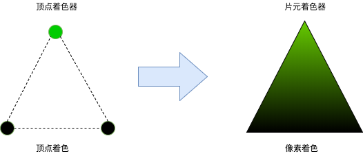
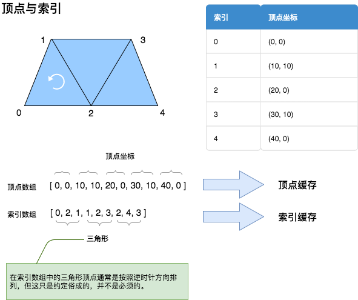
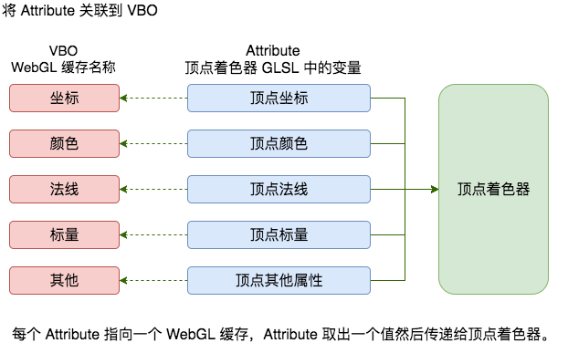
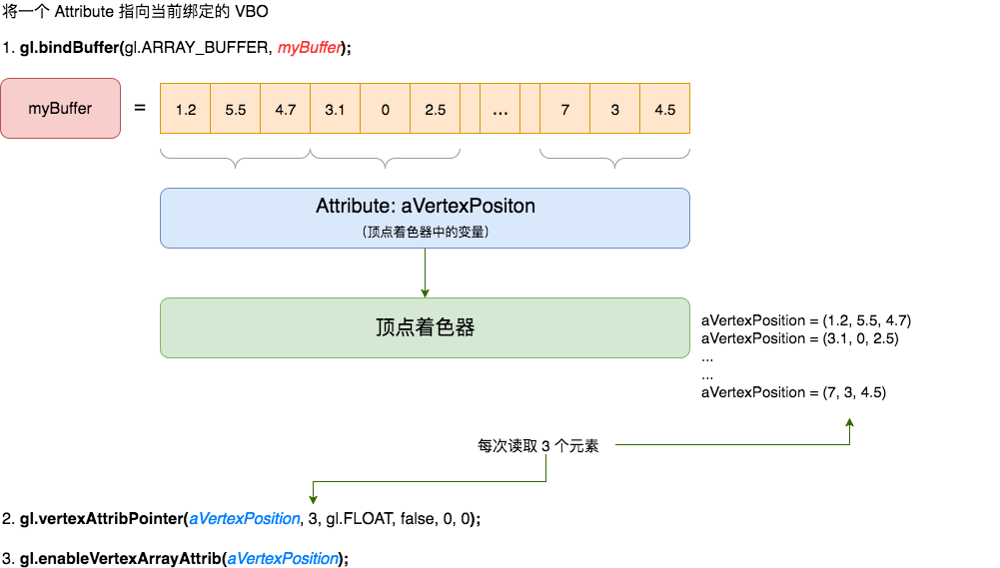
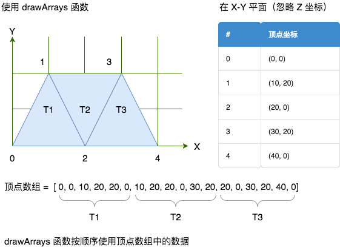
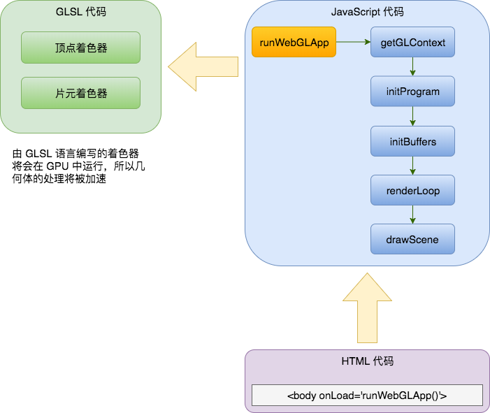

# 几何体渲染

> WebGL 在渲染物体是遵循“分治法（Divide andconquer）”原则。复杂的几何体被分解成三角形、线和点这三种基元。然后，每个几何意义上的基元在 GPU 种通过一系列步骤 —— 也就是所谓的“渲染管线” —— 进行并行处理，最终创建出显示在画布上的场景。

在本章中，我们将：

- 理解 WebGL 如何定义和处理几何信息。
- 讨论与操作几何体相关的 API 方法。
- 讨论如何使用 JSON 定义、储存和载入几何体及其原因。
- 继续讨论 WebGL 作为状态机的工作原理，以及如何设置、读取与操作几何体有关的属性状态。
- 尝试创建和载入不同的几何体模型。

## 顶点和索引

与复杂程度相当高、点线面特别多的几何体相比，WebGL 处理几何体使用了一种相对简单标准的方式。呈现 3D 物体的几何结构需要两种基本的数据类型，分别是：顶点和索引。

顶点是用于定义 3D 物体角上的点。每个顶点有三个浮点数分别代表其 x, y, z 的坐标。和 OpenGL 不同，WebGL 没有提供任何的 API 方法去向渲染管线传输顶点，因此我们需要用 JavaScript 数组重写所有顶点相关的代码，然后构建一个 WebGL 顶点缓存。

索引是指在给定的 3D 场景中每个顶点的数字标签。索引让我们可以告诉 WebGL 如何连接顶点以生成一个面。和顶点一样，索引也是储存在 JavaScript 数组中然后用 WebGL 索引缓存传值给渲染管线的。

> 有两种 WebGL 缓存用于描述和处理几何体，包含顶点数据的缓存被称为 Vertex Buffer
Objects（VBOs）。类似的，包含索引数据的缓存被称为 Index Buffer Objects（IBOs）

在继续深入之前，让我们先来看一下 WebGL 的渲染管线大概是什么样子，而在这个架构中缓存数据又扮演了什么角色。

## WebGL 渲染管线概览

在这里我们将会看到一个简易版本的 WebGL 渲染管线。在接下来的章节中，我们将会讨论其中的更多细节。


让我们花一点时间来解释其中的每一个部分。

### 顶点缓存（VBO）
VBO 包含 WebGL 所需的描述渲染几何体的信息。就想之前提到的，顶点坐标在 WebGL 中通常以 VBO 的形式储存和处理。另外，例如顶点法线、颜色、纹理坐标等等，都可以使用 VBO 为模型来储存和处理。

### 顶点着色器（Vertex Shader）
在处理每个顶点是会调用顶点着色器。这个着色器将以“逐顶点（per-vertex）”的形式处理顶点坐标、法线、颜色和纹理坐标等数据。这些数据以属性（Attributes）的形式在顶点着色器中复现。每个属性都指向一个 VBO，从中将读取顶点数据。

### 片元着色器（Fragment Shader）
每三个顶点集合将定义一个三角形，每个三角形上中图形基元都需要被分配一个颜色，否则将会呈现为透明。

每个图形基元被称为一个片元（Fragment）。因为我们最终的渲染输出是显示在你的显示器上的，所以这些图形基元有个更普通的名字：像素。

片元着色器的主要职责是计算每个独立像素的颜色，如下图所示





### 帧缓冲（Framebuffer）
帧缓冲是一个二维的缓存，其中储存着经过片元着色器处理过的片元数据。一旦所有片元都被处理完成，一张 2D 图像就被组装完成并呈现在显示器中。

帧缓冲是渲染管线的最终终点。

### Attribute、Uniform、Varying
Attribute、Uniform 和 Varying 是着色器编程中三种不同类型的变量。

Attribute 是在顶点着色器中使用的输入变量。例如，顶点坐标、顶点颜色等等。因为对于每一个顶点都将会调用顶点着色器，所以每次顶点着色器被调用时，Attribute 都将发生变化。

Uniform 是在顶点着色器和片元着色器中都可以访问的输入变量。和 Attribute 不同，Uniform 在渲染循环中是一个常量。例如，灯光的位置。

Varying 用于从顶点着色器向片元着色器中传递数据。

好了，现在让我们开始创建一个简单的几何体。

## 在 WebGL 中渲染几何体
接下来我们将按照以下步骤在 WebGL 中渲染一个几何体：

1. 首先，我们要用 JavaScript 数组定义一个几何体。
2. 其次，我们要创建相应的 WebGL 缓存。
3. 第三，我们要把一个顶点着色器 Attribute 变量指向上一步中创建的用于储存顶点数据的 VBO。
4. 最后我们用 IBO 来完成渲染。

### 使用 JavaScript 数组定义几何体
让我们来看一下如何创建一个梯形。我们需要两个 JavaScript 数组，一个用于顶点，一个用于索引。





如上图所示，我们在顶点数组中依次放置了每个顶点的坐标，然后根据其绘制梯形的方式，将它们指向索引数组。也就是说，第一个三角形是由顶点 0, 1, 2 组装成的，第二个三角形是由顶点 1, 2, 3 组成的，最后一个三角形是由顶点 2, 3, 4 组成的。我们将会按照这个流程绘制所有可能的几何体。

### 创建 WebGL 缓存
在我们创建 JavaScript 数组用于定义顶点和索引后，我们就可以开始创建对应的 WebGL 缓存。让我们用另外一个更简单的示例来看下是如何创建的。在这个示例中，我们在 x-y 平面上绘制一个简单的正方形（即 z 坐标对于所有四个顶点都是 0）。

``` javascript
var vertices = [-50.0, 50.0, 0.0,
 -50.0,-50.0, 0.0,
 50.0,-50.0, 0.0,
 50.0, 50.0, 0.0];/* our JavaScript vertex array */
var myBuffer = gl.createBuffer(); /*gl is our WebGL Context*/
```

在上一章中，我们说过 WebGL 是作为一个状态机在运行的。现在，当 `myBuffer` 被当做当前绑定的 WebGL 缓存，也就是说，所有都后续缓存操作都将依赖于此缓存，直到它被解绑，或者另外一个缓存被绑定。我们通过下面这个函数进行绑定操作：

``` javascript
gl.bindBuffer(gl.ARRAY_BUFFER, myBuffer);
```

其中的第一个参数代表了我们要穿件的缓存类型，在这个参数里，我们有两个选择：

- `gl.ARRAY_BUFFER`：顶点数据
- `gl.ELEMENT_ARRAY_BUFFER`：索引数据

在这个示例中，我们要创建顶点坐标的缓存，因此我们使用了 `gl.ARRAY_BUFFER` 参数。对于索引数据，则要使用 `gl.ELEMENT_ARRAY_BUFFER`。

> WebGL 会一直访问当前绑定的缓存区查找数据，因此在进行任何其他操作时务必确认正确绑定了缓存。
> 如果 WebGL 没有找到当前绑定缓存，会抛出 `INVALID_OPERATION` 错误。

在绑定缓存后，我们需要将其中的数据传递给 WebGL。我们使用 `bufferData` 函数。

``` javascript
gl.bufferData(gl.ARRAY_BUFFER, new Float32Array(vertices), gl.STATIC_DRAW);
```

在这个示例中，`vertices` 是一个储存顶点坐标的 JavaScript 数组。但是 WebGL 并不能直接接受 JavaScript 数组 作为 `bufferData` 函数的参数。相反，WebGL 使用类型化数组（typed array），这样做的原因是缓存数据可以直接被当做二进制数据来进行处理，以提升性能。

> 关于类型化数组（typed array）的标准可以访问： http://www.khronos.org/registry/typedarray/specs/latest/

WebGL 使用的类型化数组包括 `Int8Array`、`Uint8Array`、`Int16Array`、`Uint8ClampedArray`、`Int16Array`、`Uint16Array`、`Int32Array`、`Uint32Array`、`Float32Array` 和 `Float64Array`。

通过观察我们可以发现，顶点坐标可以是浮点数，但是索引永远是整型数。因此，在本书中，对于 VBO 我们使用 `Float32Array`，而对于 IBO 我们使用 `Uint16Array`。这是因为在本书出版的年代，这两个类型是在 WebGL 每次渲染命令中可以使用的最大的类型化数组。目前（2018年），类型化数组已经得到了普遍的支持。

因为在本书中使用了 16 位的类型化数组来储存索引，所以数组的最大长度被限制在了 65535。也就是说，如果你的几何体的索引数量超过了 65535，那么你需要调用多次渲染命令。我们将在本章稍后讲解这一问题。

> 除了自身图形能力之外，类型化数组是 WebGL 对 Web 额外的巨大贡献之一，正是因为实现 WebGL 才引入的类型化数组，使得 JavaScript 有了灵活处理二进制数据的能力。
> 
> 即使在当年微软竭尽全力反对 WebGL 的时候，微软 IE 团队也不得不引入对类型化数组的支持，往事都已成过眼云烟，推荐阅读：http://www.hiwebgl.com/?p=803 。
> 
> 另外，类型化数组的标准的拥有者是 WebGL 和 OpenGL 背后的 Khronos Group，而不是 W3C 和 WHATWG。

最后，作为好的习惯，我们再对缓存进行解绑。我们调用如下命令：

``` javascript
gl.bindBuffer(gl.ARRAY_BUFFER, null);
```

然后我们对每一个 WebGL 缓存（VBO 和 IBO）多次重复调用相同的函数.

让我们回顾一下我们刚刚学习的示例。我们在 `initBuffers` 函数中建立了 VBO 和 IBO。

``` javascript
function initBuffers() {

    vertices =[1.5, 0, 0, 
    -1.5, 1, 0, 
    -1.5, 0.809017,	0.587785,
    -1.5, 0.309017,	0.951057, 
    -1.5, -0.309017, 0.951057, 
    -1.5, -0.809017, 0.587785,
    -1.5, -1, 0, 
    -1.5, -0.809017, -0.587785,
    -1.5, -0.309017, -0.951057, 
    -1.5, 0.309017,	-0.951057, 
    -1.5, 0.809017,	-0.587785];

    indices = [0, 1, 2,
    0, 2, 3,
    0, 3, 4,
    0, 4, 5,
    0, 5, 6,
    0, 6, 7,
    0, 7, 8,
    0, 8, 9,
    0, 9, 10,
    0, 10, 1];

    //The following code snippet creates a vertex buffer and binds data to it
    coneVertexBuffer = gl.createBuffer();
    gl.bindBuffer(gl.ARRAY_BUFFER, coneVertexBuffer);
    gl.bufferData(gl.ARRAY_BUFFER, new Float32Array(vertices), gl.STATIC_DRAW);
    
    
    coneIndexBuffer = gl.createBuffer();
    gl.bindBuffer(gl.ELEMENT_ARRAY_BUFFER, coneIndexBuffer);
    gl.bufferData(gl.ELEMENT_ARRAY_BUFFER, new Uint16Array(indices), gl.STATIC_DRAW);
    
    gl.bindBuffer(gl.ELEMENT_ARRAY_BUFFER, null);
    gl.bindBuffer(gl.ARRAY_BUFFER,null);

}
```

总结一下，也就是说对于每一个数组缓存，我们做的事情是：

- 创建新缓存
- 将其绑定称为当前缓存
- 使用类型化数组将数据传递给缓存
- 解绑缓存

#### 操作 WebGL 缓存

操作 WebGL 缓存的总结如下表：

| 函数方法                                            | 描述                                                                                                                                                                                                                                                                                                                                                                  |
| --------------------------------------------------- | --------------------------------------------------------------------------------------------------------------------------------------------------------------------------------------------------------------------------------------------------------------------------------------------------------------------------------------------------------------------- |
| `var aBuffer = createBuffer(void)`                  | 创建一个名为 `aBuffer` 的缓存                                                                                                                                                                                                                                                                                                                                         |
| `deleteBuffer(Object aBuffer)`                      | 删除一个名为 `aBuffer` 的缓存                                                                                                                                                                                                                                                                                                                                         |
| `bindBuffer(ulong target, Object buffer)`           | 绑定一个缓存对象。`target` 参数接受如下的值：<br>- `ARRAY_BUFFER`：用于顶点数组<br>- `ELEMENT_ARRAY_BUFFER`：用于索引数组                                                                                                                                                                                                                                                   |
| `bufferData(ulong target, Object data, ulong type)` | 向一个缓存对象传值。`target` 参数接受如下的值：<br>- `ARRAY_BUFFER`：用于顶点数组<br>- `ELEMENT_ARRAY_BUFFER`：用于索引数组<br><br>`type` 参数是一个性能相关的参数，接受如下的值：<br>- `STATIC_DRAW`：缓存中的数据不会发生变化（一次传值，多次使用）<br>- `DYNAMIC_DRAW`：数据会频繁发生变化（多次传值，多次使用）<br>- `STREAM_DRAW`：数据在每次渲染循环中都会变化（一次传值，一次使用） |

### 将 Attribute 关联到 VBO

一旦 VBO 建立完毕，我们就可以用顶点着色器的 Attribute 属性将其关联起来。每个顶点着色器的 Attribute 属性都会引用一个并且只会引用一个缓存，它们的对应关系如下图：





我们可以把步骤总结为：

1. 首先，我们绑定一个 VBO。
2. 接下来，我们将一个 Attribute 指向当前绑定的 VBO。
3. 最后，我们启用这个 Attribute。

#### 绑定 VBO

我们已经学会如何去做：

``` javascript
gl.bindBuffer(gl.ARRAY_BUFFER, myBuffer);
```

其中 `myBuffer` 就是我们想要映射的缓存。

#### 将一个 Attribute 指向当前绑定的 VBO

在下一章中我们将会学习如何定义顶点着色器中的 Attribute，在这里我们先假定我们有一个叫做 `aVertexPosition` 的 Attribute，它在顶点着色器中将会扮演顶点位置的角色。

在 WebGL 中将 Attribute 指向当前绑定的 VBO 的函数是 `vertexAttribPointer`。它的使用方法如下“

``` javascript
gl.vertexAttribPointer(Index, Size, Type, Normalized, Stride, Offset);
```

让我们来看下其中的参数：

- `Index`：着色器中 Attribute 变量的索引值。
- `Size`：每个顶点需要从当前绑定的缓存中多少个值。
- `Type`：当前缓存中值的数据类型，接受如下的值：
	- `gl.BYTE`：带符号8位整型数，区间为 \[-128, 127\]。
	- `gl.SHORT`：带符号的16位整型数，区间为 \[-32768, 32767\]。
	- `gl.UNSIGNED_BYTE`：不带符号的8位整型数，区间为 \[0, 255\]。
	- `gl.UNSIGNED_SHORT`：不带符号的16位整型数，区间为 \[0, 65535\]。
	- `gl.FLOAT`：32位 IEEE 浮点数。
	- `gl.HALF_FLOAT`：16位 IEEE 浮点数（仅支持 WebGL 2.0）。
- `Normalized`：布尔值，如果数据类型是整型数，是否需要归一化。对 `gl.BYTE` 和 `gl.SHORT` 类型的值，会归一化为 \[-1, 1\] 区间；对 `gl.UNSIGNED_BYTE` 和 `gl.UNSIGNED_SHORT`，会归一化为 \[0, 1\] 区间；对浮点数类型本参数无效。
- `Stride`：每个顶点的 Attribute 在 GPU 显存中的储存位移，最大不能超过 255。如果设为 0，则代表每个顶点的 Attribute 会紧凑的相继储存，中间没有其他的数据块，下一个顶点的 Attribute 会紧跟着当前顶点的 Attribute。
- `Offset`：位移，是指从缓存数组的第几个元素开始读取 Attribute。通常设置为 0，代表从缓存数组的第一个元素开始读取。

> `vertexAttribPointer` 定义了一个从当前绑定的缓存中读取信息的指针。如果没有绑定当前 VBO，则会抛出错误异常。

#### 启用 Attribute

最后，我们只需要激活顶点着色器中的 Attribute。在示例中，我们添加如下代码：

``` javascript
gl.enableVertexAttribArray (aVertexPosition);
```

下面的图例解释了 Attribute 和 VBO 之前的映射流程：





### 渲染

当 VBO 第一完成，并且映射到顶点着色器中相应的 Attribute 变量中后，我们就可以开始渲染了。

我们需要用到两个 API 其中之一 —— `drawArrays` 或 `drawElements`。

#### `drawArrays` 和 `drawElements` 函数

`drawArrays` 和 `drawElements` 函数用于向帧缓冲中写入数据。

`drawArrays` 直接使用顶点数据来创建几何体；相对应的，`drawElements` 使用索引数据然后再根据索引获取顶点数据来创建几何体。

`drawArrays` 和 `drawElements` 函数都必须使用使用激活的数组数据，也就是说必须把 VBO 映射到 Attribute 后激活 Attribute。

在我们的示例中，我们只有一个激活的数组数据，即包含顶点坐标的那个数组。其实，在更加普遍的场合下，我们通常都会激活多个数组数据。例如，我们可以将顶点颜色、顶点法线、纹理坐标和其他逐顶点数据都放到映射到 Attribute 的数组中并激活它们。

> 使用多个 VBO
> 在下一张中，我们将会看到我们如何使用法线数据来创造光照模型。在那个示例中，我们将会使用两个激活的数组数据：顶点坐标和顶点法线。

#### 使用 `drawArrays`

在没有索引数组的情况下，我们将直接使用 `drawArrays` 函数。在更多的情况下，`drawArrays` 经常用于绘制非常简单的几何体，简单到为其创建索引数组反而是多此一举的程度；比如说，当我们想要渲染一个三角形或者一个矩形的时候。在这时，WebGL 会按顺序去读取 VBO 中定义的顶点坐标创建几何体。如果你的几何体中含有多个三角形（例如我们之前图示中的梯形），那你可以在 VBO 中重复列出这些顶点坐标。

如果你需要重复太多次顶点坐标，那么使用 `drawArrays` 函数就不是一个好主意了。VBO 中重复的顶点越多，顶点着色器就要越多的运行。这会大大降低程序性能，因为太多相同的顶点多次进入顶点着色器处理，带来不必要的计算量。





`drawArrays` 函数的语法是：

``` javascript
gl.drawArrays(Mode, First, Count)
```

其中：

- ` Mode`：表示将要渲染绘制的基元的类型，可选值为：`gl.POINTS`、`gl.LINE_STRIP`、`gl.LINE_LOOP`、`gl.LINES`、`gl.TRIANGLE_STRIP`、`gl.TRIANGLE_FAN`、`gl.TRIANGLES`。我们将在下一节中详细解释。
- `First`：指定起始元素。
- `Count`：指定绘制元素的数量。

> WebGL 标准原文：
>  当 `drawArrays` 被调用时，它使用每个激活的数组中从第 `First` 个开始的 `Count` 个序列元素去构建一个几何基元序列。`Mode` 指定了使用哪种基元去构建，以及如何数组元素如何构建这些基元。

#### 使用 `drawElements` 函数

与之前没有 IBO 的情况不同，`drawElements` 函数允许我们使用 IBO 去告诉 WebGL 如何渲染几何体。请记住二者的区别，`drawArrays` 使用 VBO，`drawElements` 使用 IBO。对于 `drawArrays` 来说，顶点着色器会根据顶点在 VBO 出现的次数，去重复处理它们；与之不同的是，`drawElements` 使用了索引，因此每个顶点只会被处理一次，但是会根据它们在 IBO 中定义的次数，被多次复用。这个特性降低了 GPU 的性能消耗和显存消耗。

让我们重新读一下这张图


当我们使用 `drawElements` 的时候，我们需要至少两个缓存，一个是 VBO，另一个是 IBO。顶点着色器将会对 VBO 中的每个顶点运行一次，然后渲染管线会使用 IBO 中的数据组装进三角形。

> 当使用 `drawElements` 的时候，记得确保与 VBO 对应的 IBO 被正确绑定。

`drawElements` 函数的语法为：

``` javascript
gl.drawElements(Mode, Count, Type, Offset)
```

其中：

- `Mode`：表示将要渲染绘制的基元的类型，可选值为：`POINTS`、`LINE_STRIP`、`LINE_LOOP`、`LINES`、`TRIANGLE_STRIP`、`TRIANGLE_FAN`、`TRIANGLES`。
- `Count`：指定绘制元素的数量。
- `Type`：指定索引中的数据类型，因为索引数据都是正整数，所以必须是 `UNSIGNED_BYTE` 或 `UNSIGNED_SHORT`。
- `Offset`：指定从哪个元素开始绘制，通常是 0，即第一个元素。

> WebGL 毫无修改的继承了 Open GL ES 2.0 中关于 `drawElements` 的描述：
> 当 `drawElements` 被调用时，它使用每个激活的数组中的从 `Offset` 开始的 `Count` 个序列元素去构建一个几何基元序列。`Mode` 指定了使用哪种基元去构建，以及如何数组元素如何构建这些基元。如果有多个激活的数组，每个都会被使用。

### 总结到一起

我想你一定急不可耐地想要把这些知识总结道一起了，让我们开始写代码吧！我们来创建一个简单的 WebGL 程序来绘制一个正方形。

1. 让我们看下完整的网页文件代码，完整代码请点击[这里](https://bitbucket.org/dcantor/webgl-beginners-guide-code/src/a27b84e89b926c4a79bcd3c3b566486c53c38ee2/1727_02/ch2_Square.html?at=master&fileviewer=file-view-default)。

2. 下面图标解释了这个网页文件的架构。





3. 网页包含如下部分：

- `<script id="shader-fs" type="x-shader/xfragment">` 标签中包含了片元着色器的代码。
- `<script id="shader-vs" type="x-shader/x-vertex">` 标签中包含了顶点着色器的代码。我们会在后面学习更多关于着色器的知识。
- ` <script id="code-js" type="text/javascript">` 标签中包含了所需的全部 WebGL JavaScript 代码。其中包含了如下的程序：
	- `getGLContext`：和前一章我们看到的函数类似，这个函数用于获取 WebGL 上下文。
	- `initProgram`：这个函数引用了顶点着色器和片元着色器代码，并将他们传递给 GPU 进行编译。我们稍后会学习。
	- `initBuffers`：这个函数包含了创建 WebGL 缓存并初始化的 API。在这个示例中我们将创建一个 VBO 来储存正方形的顶点坐标和一个 IBO 来储存绘制正方形所需的索引数组。
	- `renderLoop`：这个函数用于创建渲染循环。程序将调用这个函数来周期性的更新场景（使用 [`requestAnimationFrame`](https://developer.mozilla.org/zh-CN/docs/Web/API/Window/requestAnimationFrame) ）
	- `drawScene`：在这个函数中，我们将 VBO 映射到相应的顶点缓存中的 Attribute，并且启用这个 Attribute；然后绑定 IBO 并调用 `drawElements` 函数。
	- 最后，我们在 `<body>` 标签中为 `onLoad` 事件添加 `runWebGLApp` 函数。

4. 找到 `initBuffer` 函数。请注意代码注释中的图示，这个简单的图示描述了顶点和索引是如何组织的。

5. 你可以尝试修改顶点坐标数组和索引数组，试着画一个五边形试试。
