# 光照

> 在 WebGL 中，我们使用顶点着色器和片元着色器来为场景创建光照模型。在着色器中，我们可以创建一个数学模型来决定场景如何受光照影响。我们将学习不同的光照算法，并通过示例来实现它们。

本章的内容需要你对线性代数的基本知识有一定的掌握。我们将使用 glMatrix 这个 JavaScript 库来进行矢量和矩阵的数学运算，所以你不需要担心如何实现基本运算。尽管如此，你依然应该对线性代数中的基本运算有清晰的概念。

在这一章中，我们将：

- 学习光源、法线和材质。
- 学习着色和光照的区别。
- 使用高洛德着色法（Goraud Shading）和冯氏着色法（Phong Shading），以及兰伯特光照模型（Lambertian Lighting Model）和冯氏光照模型（Phong Lighting Model）。
- 定义并使用 Uniform、Attribute 和 Varying 变量。
- 使用 WebGL 的着色器语言 ESSL。
- 讨论与着色器相关的 WebGL API。
- 继续我们关于 WebGL 作为状态机的工作原理，讨论如何设置与着色器相关的 Attribute 并读取它们的状态。

## 光照、法线和材质

在真实世界中，我们可以看见物体是因为物体会反射光线。任何物体都会根据与光源的相对位置和距离来反射光线；物体表面的朝向（在图形学中用法线向量表示）和物体表面的材质，决定了光线如何被反射。在本章中，我们将会学习如何在 WebGL 中结合这三者去建立不同的光照模型。


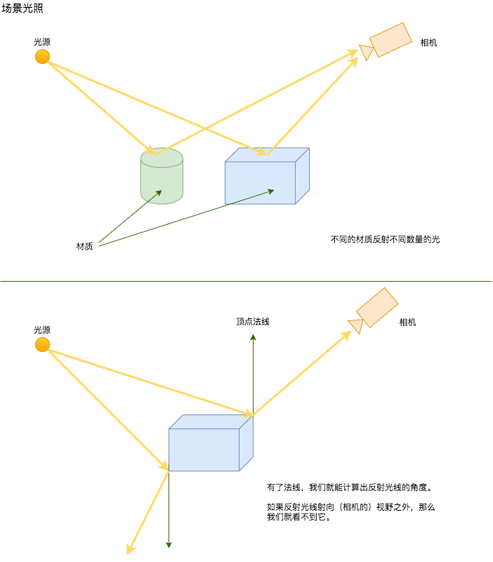


### 光照

光源可以是位置敏感的或方向敏感的。位置敏感的光源意味着光源的位置可以左右其对场景光照。例如房间中的一盏蜡烛，离蜡烛越远的物体接收到的光照就越小，甚至会消失在黑暗中。相反，方向敏感的光源是指无论光源的位置如何，场景中的所有物体都会受到相同的光照。例如太阳光，太阳会照亮大地上的每一个物体，无论他们与太阳的距离有多远。

> 因为太阳离地球的距离太远了，所以地球上每个物体与太阳的距离之间的差异都可以忽略不计。

位置敏感的光源我们用空间中的一个点来表示，而方向敏感的光源我们则用一个向量来指示它的光线照射方向。为了数学上的运算方便，我们通常使用归一化向量。

### 法线

法线是指与接受光照的物体表面垂直的向量。法线代表了物体表面的朝向，因此它是接受光照过程中至关重要的一个角色。每个顶点都有一个与之相关的法线向量。

我们使用叉积来计算法线。

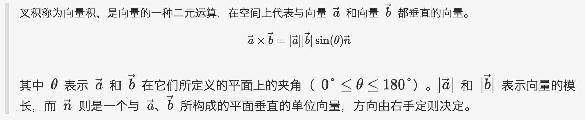

> 叉积称为向量积，是向量的一种二元运算，在空间上代表与向量 $\vec a$ 和向量 $\vec b$ 都垂直的向量。
> $$\vec a \times \vec b = \vert \vec a \vert \vert \vec b \vert \sin (\theta) \vec n $$
> 其中 $\theta$  表示 $\vec a$ 和 $\vec b$ 在它们所定义的平面上的夹角（ $0° \le \theta \le 180°$）。$\vert \vec a \vert$ 和 $\vert \vec b \vert$ 表示向量的模长，而 $\vec n$ 则是一个与 $\vec a$、$\vec b$ 所构成的平面垂直的单位向量，方向由右手定则决定。

让我们来详细讲述下。假设我们有三角形，其顶点为 `p0`、`p1`、`p2`，然后我们定义向量 `v1` = `p1` - `p0`，向量 `v2` = `p2` - `p0`。那么 `p0` 点的法线就是向量 `v1` 和 `v2` 的叉积。用向量空间图像表示如下：


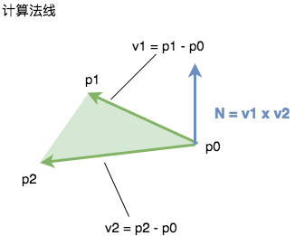


然后我们可以对几何体表面的每个三角形的每个顶点都进行相同的计算。但是对于多个三角形共享的顶点该如何计算呢？答案是，对于多个三角形共享的顶点，它的法线是所有共享三角形计算出的法线向量的和。


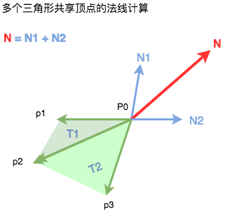


与光线类似，为了方便数学运算，法线向量通常也会被归一化。

### 材质

在 WebGL 中物体的材质是由多个参数共同决定的，包括颜色、纹理等等。材质颜色通常使用 RGB 色彩空间表示。纹理，也就是将一张图片贴合到物体表面，这个过程被称为纹理映射（Texture Mapping）。我们将会在第七章 纹理中详细阐述。

## 在渲染管线中使用光照、法线和材质

我们曾在第二章中提到过，WebGL 缓存、Attribute 和 Uniform 都是着色器中的输入变量，而 Varyings 则是用于从顶点着色器向片元着色器输送数据。让我们重新回顾一下渲染管线，来看看如何在其中嵌入光照、法线和材质。


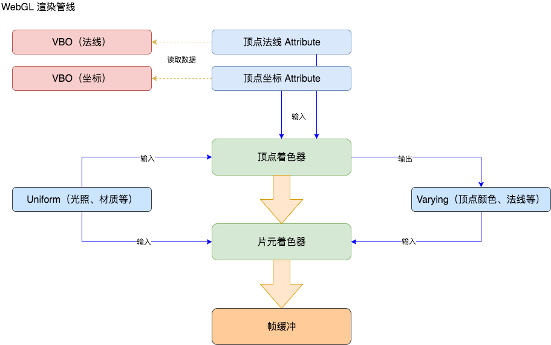


法线是一个逐顶点属性，所以在 WebGL 中是作为 VBO 映射到 Attribute 中的。请注意 Attribute 是不能输入到片元着色器中的。

光照和材质是作为 Uniform 传入的。Uniform 是在顶点着色器和片元着色器中都可以访问的。这就给与了我们计算光照模型充分的自由度，因为我们既可以在顶点着色器中计算逐顶点的光照，也可以在片元着色器中计算逐片元的光照。

> 在 WebGL 中，顶点着色器和片元着色器结合在一起被称为着色器程序 Program。

### 并行计算以及 Attribute 和 Uniform 之间的区别

区分 Attribute 和 Uniform 是一件非常重要的是。当调用绘制命令时（使用 `drawArrays` 或 `drawElements`），GPU 将会并行运行多份顶点着色器，每份顶点着色器都会接收到不同的 Attribute 值。这些 Attribute 值来自于与之对应的 VBO。

另一方面，所有运行的顶点着色器都会接收到相同的 Unifrom。在每次绘制命令中，Uniform 可以被视作常量。


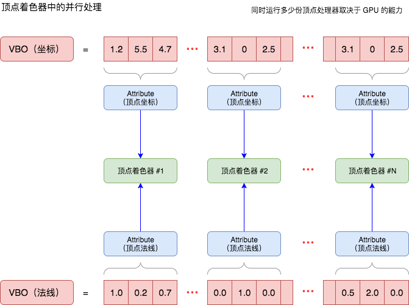


一旦光照、法线和材质被传递进入着色器程序，下一步就是决定我们采用哪种着色和光照模型。

## 着色方法和光线反射模型

着色（Shading）和光照（Lighting）这两个术语经常被混淆。然而，它们指的是两个不同的概念。首先，着色是指使用某种插值算法获得场景中每个片元的最终颜色。我们会稍后解释插值算法的概念。现在就让我们把它简单理解为着色的发生地点，是在顶点着色器还是在片元着色器。其次，一旦着色模型建立之后，光照模型决定了法线、材质和光照是如何组合在一起产生最终颜色的。光照模型的公式遵循光线反射的物理法则。因此光照模型也被称为反射模型。

### 着色/插值方法

在这小节中，我们将会分析两种基本的插值方法：高洛德着色（Goraud Shading）和冯氏着色（Phong Shading）。

#### 高洛德着色（Goraud Shading）

高洛德着色是在顶点着色器中计算最终颜色的，在计算过程中需要用到顶点法线，然后使用 Varying 变量将计算出的顶点颜色传递到片元着色器中。因为渲染管线会对 Varying 变量进行自动插值，每个三角形中的每个片元都会获得插值颜色作为最终颜色。

> Varying 变量的插值是由渲染管线自动完成的，无需编程。

#### 冯氏着色（Phong Shading）

冯氏着色是在片元着色器中计算最终颜色的。为了达到这个目的，每个顶点法线都会作为 Varying 变量从顶点着色器传递至片元着色器中。因为 Varying 变量的插值计算是由渲染管线自动完成的，所以每个片元都会获得自己的法线。然后我们使用每个片元自己的法线来计算其最终颜色。

这两种插值着色算法模型可以参照下面的图示：


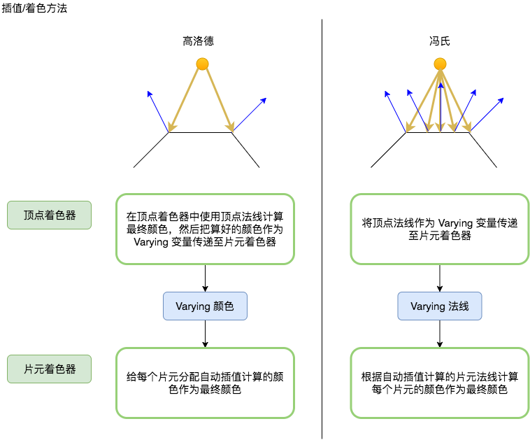


在这两种着色方法中，都没有指定最终颜色的计算算法，它们的区别只是在于在哪里进行颜色计算（顶点着色器还是片元着色器），以及对什么进行插值（顶点颜色还是顶点法线）。

### 光线反射模型

在之前我们提到过，光线反射模型是独立于着色/插值方法的。着色方法只是指定了在哪里计算最终颜色，而光线反射模型则决定了如何计算颜色。

#### 兰伯特（Lambertian）光线反射模型
兰伯特反射是在计算机图形学中计算漫反射时常用的一种反射模型，漫反射是指单一的入射光线经过多个角度反射后会造成多个反射光线，而与之相对的是高光反射（镜面反射）。

这个光照模型是基于**余弦辐射定律**，也被称为**兰伯特余弦定律**的。这是由瑞士数学家、物理学家、天文学家和哲学家约翰·海因里希·兰伯特于 1760 年出版的著作《测光学（Photometria）》中提出的。

兰伯特反射通常是先计算出法线向量（顶点的或片元的，由着色方法决定）和入射光线向量取反（即从物体表面指向光源位置的向量）后的点积，然后再乘以材质颜色和光源颜色。


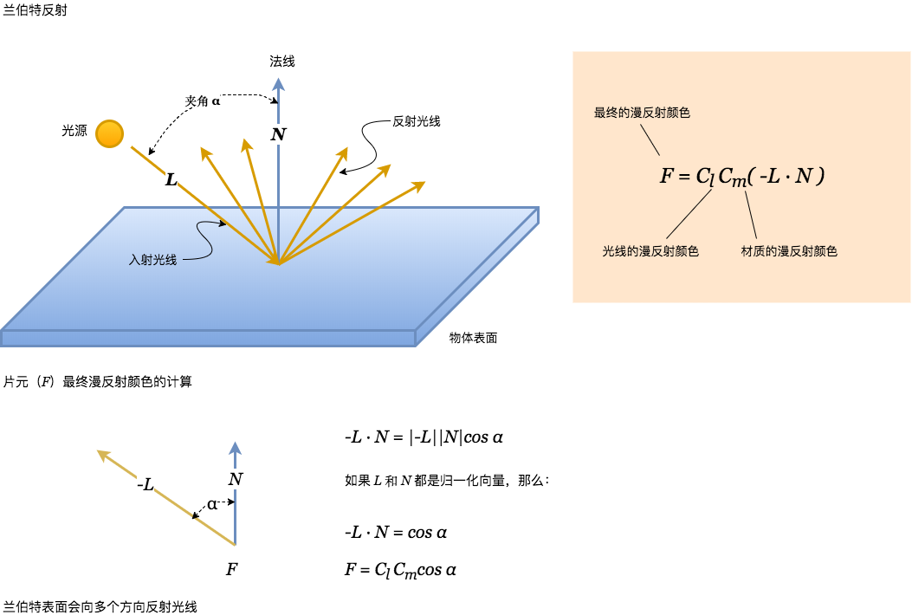


#### 冯氏（Phong）光线反射模型

冯氏反射模型描述了一个物体表面反射光线的方式，并总结出三种反射类型：环境反射、漫反射和高光反射。这个理论是由越南裔美国人裴祥风（Bùi Tường Phong）在他于 1973 年发表的博士论文中提出的。

> 裴祥风姓裴，但是在提交论文时没有使用姓氏后置的英文姓名书写方式，因此在西方把名字末尾的 Phong 误认为是他的姓氏，所以被称为冯氏（Phong）光线反射模型。根据维基百科上的资料，裴祥风本人于 1942 年出生于越南河内，在法国接受早期教育，后考入犹他大学。当他在学生时期就已经罹患晚期白血病，1975 年他获得了斯坦福大学的教授职位，在同年 6 月发表了他人生中的最后一篇论文。一个月后，也就是 1975 年 7 月裴祥风因白血病逝世。在互联网上连张靠谱的照片都没有留下。


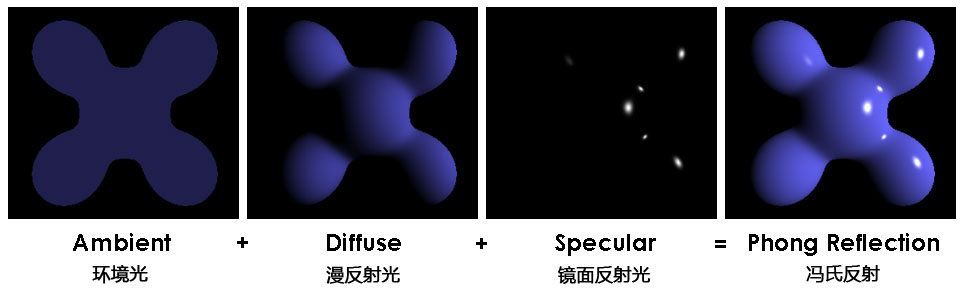


其中环境光是指遍布场景所有角落的散射的光，不依赖于任何光源。

漫反射光对应于漫反射，在这里通常直接使用兰伯特反射模型计算。

高光（镜面反射光）是指类似于镜子表面反射的光。也就是说，当我们在与入射角相同的角度观看物体表面时，会接收到最强烈的反射光线。

高光反射的数学模型是由两个向量的点积表示的，一个向量是眼向量（Eye vector），另一个是反射光线方向向量。眼向量是指从片元指向观测位置（即相机）的向量。反射光线方向向量是由入射光线向量以法线向量为轴镜像后得到的向量。当点积等于 1 时（使用归一化向量），相机就会接收到最强烈的高光反射。

然后这个点积再进行乘方运算，指数为代表表面光泽度的参数。最后这个结果再和光线的高光颜色和材质的高光颜色相乘。


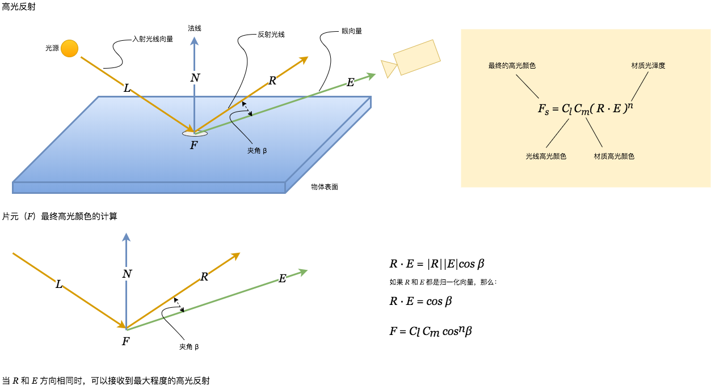


环境光、漫反射光和高光相加，最终得出片元的最终颜色。

接下来让我们来学习一下如何在顶点着色器和片元着色器中实现着色的语言，这就是 ESSL 语言。

## ESSL —— OpenGL ES Shading Language

OpenGL ES Shading Language（ESSL）是用于编写着色器的语言。它的语法和风格和 C/C++ 很像。但是它其中内置了数据类型和函数，让开发者可以更轻松方便地操控向量和矩阵。在这一章节，我们将会学习 ESSL 的基础知识。

> 本章节是 GLSL ES 标准的一个小结。 ESSL 是 GLSL（OpenGL Shading Language）的一个子集。
> 完整标准原文链接：https://www.khronos.org/files/opengles_shading_language.pdf

### 储存修饰符

在声明变量前必须添加储存修饰符，以指定变量的储存方式：

- `attribute`：连接 WebGL 应用和顶点着色器的逐顶点数据。此修饰符只能用于顶点着色器。
- `uniform`：连接 WebGL 应用和着色器的数据，在处理过程中不会发生变化。此修饰符既可以在顶点着色器中使用，也可以在片元着色器中使用。如果在两个着色器中都需要用到同一个 uniform，那么声明必须相同。
- `varying`：连接顶点着色器和片元着色器的插值数据。varying 变量是由顶点着色器和片元着色器共享的，所以声明必须相同。
- `const`：编译时常量，或者作为只读的函数参数，可以在 ESSL 程序的所有地方调用。

### 数据类型

ESSL 提供如下基本的数据类型：

- `void`：用于没有返回值或者参数列表为空的函数。
- `bool`：条件类型，取值为 `true` 或 `false`。
- `int`：带符号的整型数。
- `float`：单精度浮点数，标量。
- `vec2`：二维浮点向量。
- `vec3`：三维浮点向量。
- `vec4`：四维浮点向量。
- `bvec2`：二维布尔向量。
- `bvec3`：三维布尔向量。
- `bvec4`：四维布尔向量。
- `ivec2`：二维整数向量。
- `ivec3`：三维整数向量。
- `ivec4`：四维整数向量。
- `mat2`：2x2 浮点矩阵。
- `mat3`：3x3 浮点矩阵。
- `mat4`：4x4 浮点矩阵。
- `sampler2D`：用于访问 2D 纹理。
- `samplerCube`：用于访问 cube map 纹理。

所以声明一个变量需要先写三种储存修饰符中的一种，再写数据类型，再写变量名。例如我们可以这么声明一个 varying 颜色变量：

``` glsl
varying vec4 vFinalColor;
```

这意味着 `vFinalColor` 是一个 varying 四维向量。

### 向量的分量

> n 个有顺序的数 a0, a1, a2, ... an 组成的有序数组称为一个 n 维向量，其中 a0, a1, a2, ... an 称为向量的**分量**。

在 ESSL 中，我们可以通过下标访问向量的每个分量。

例如：

`vFinalColor[3]` 指的是向量 `vFinalColor` 的第四个分量。向量的下标索引是从 0 开始的。

同时，你也可以使用字母来访问向量的分量

| 形式 | 常用用途 |
| -------------- | -------------------------------- |
| `{x, y, z, w}` | 用于访问代表坐标或其他向量的向量 |
| `{r, g, b, a}` | 用于访问代表颜色的向量           |
| `{s, t, p, q}` | 用于访问代表纹理坐标的向量       |

比如说，如果我们用一个四维向量代表 RGBa 色彩空间的红色、绿色、蓝色和 alpha 值，我们可以这么设定其 alpha 为 1。

``` glsl
vFinalColor[3] = 1.0;
```

或者

``` glsl
vFinalColor.a = 1.0;
```

当然，如果愿意的话，我们也可以写成：

``` glsl
vFinalColor.w = 1.0;
```

这三种方法都可以访问向量的第四个分量。然而，由于 `vFinalColor` 是代表一个颜色，所以使用 `{r, g, b, a}` 的访问方式是更合理的方式，它会让代码更加易读。

同时，也可以使用字母引用来生成向量的子集（详情参考 [GLSL ES 标准第 44 页](https://www.khronos.org/files/opengles_shading_language.pdf)）：

``` glsl
vec4 v4;
 v4.rgba; // is a vec4 and the same as just using v4,
 v4.rgb; // is a vec3,
 v4.b; // is a float,
 v4.xy; // is a vec2,
 v4.xgba; // is illegal - the component names do not come from the same set.
```

### 运算符与函数

ESSL 也提供了很多有用的运算符和函数来简化矢量和矩阵的数学运算。根据 ESSL 标准：二元算数运算符加（`+`）、减（`-`）、乘（`*`）、除（`/`）可以操作包括整形术和浮点数类型的表达式（包括向量和矩阵）。运算符两端必须是同一种数据类型的表达式，或者一端是浮点数标量另一端是浮点向量或矩阵，或者一端是整型数标量另一端是整型数向量。另外，对于乘法（`*`），一端可以是向量另一端可以是与向量维数相同的矩阵。运算结果的基本数据类型（整型数或浮点数）与进行运算的表达式相同。如果一端是标量另一端是向量或矩阵，那么向量或矩阵的每个元素都会与这个标量相乘，最终结果的基本数据类型与向量或矩阵相同。用 0 做除数不会导致异常，但是结果不可预测。

- `-x`：向量 `x` 取反。也就是与 `x` 向量方向相反的向量。
- `x + y`：向量 `x` 和向量 `y` 的和。两个向量必须维数相同。
- `x - y`：向量 `x` 和向量 `y` 的差。两个向量必须维数相同。
- `x * y`：如果 `x` 和 `y` 都是向量，那么将会对向量的每个分量进行乘法运算；如果两者都是矩阵，那么将会计算线性代数意义上的矩阵乘法，而不是将矩阵的每个对位元素相乘（如果你想让矩阵的每个对位元素相乘，应该使用 `matrixCompMult()` 函数）。
- `x / y`：除法运算符和乘法运算符类似。
- `dot(x, y)`：返回两个向量的点积。两个向量必须维数相同。
- `cross(vec3 x, vec3 y)`：返回两个向量的叉积。两个向量必须是三维向量。
- `matrixCompMult(mat x, mat y)`：将两个矩阵的每个对位元素相乘。两个矩阵必须维数相同（都是 `mat2`、`mat3` 或 `mat4`）。
- `normalize(x)`：将向量归一化，即返回相同方向但模长为 1 的向量。
- `reflect(t, n)`：返回入射向量 `t` 关于法向量 `n` 的 镜面反射向量。

另外还有很多三角函数和指数函数。我们会在用到的时候进行讲解。

让我们现在来看一个简单的 ESSL 着色器程序的例子，它包含以下特性：

- 兰伯特反射模型：我们将会使用一个光源在场景进行漫反射计算。也就是说我们将使用 uniform 变量来定义光源的属性、材质属性，然后遵循兰伯特余弦定律来计算每个顶点的最终颜色。
- 高洛德着色法：我们将对顶点颜色进行插值获得每个片元的最终颜色，使用 varying 变量传入片元着色器。

让我们先来剖析一下 Attribute、Uniform 和 Varying 变量。

### 顶点着色器中的 Attribute

我们先从在顶点着色器中定义的两个 Attribute 变量开始。每个顶点都会有：

``` glsl
attribute vec3 aVertexPosition;
attribute vec3 aVertexNormal;
```

在关键词 `attribute` 右侧，我们可以看到变量的数据类型。在这个例子中，每个顶点的坐标都是由 (x, y, z) 三个坐标组成的，因此是 `vec3`。类似的，顶点法线也是由三个元素 (x, y, z) 组成的空间向量代表，所以也是 `vec3`。注意，虽然顶点坐标和顶点法线都是 `vec3`，但是它们代表的空间几何意义完全不同，顶点坐标是指三维空间中的一个点，而顶点法线是指几何体表面朝向的空间向量。

另外，请记住 Attribute 只能用于顶点着色器。

### Uniform

Uniform 在顶点着色器和片元着色器中都可以使用。每次顶点着色器运行的时候 Attribute 的值都不一样（顶点是并行处理的，每份顶点着色器处理各自不同的顶点），而 Uniform 的值在一个渲染循环中是固定的，即每次 WebGL 调用 `drawArrays` 和 `drawElements` 期间。

因此利用这个特性，我们可以使用 Uniform 传递光源（例如漫反射颜色、方向等）和材质（例如漫反射颜色、光泽度等）的信息。

举例来说：

``` glsl
uniform vec3 uLightDirection; //incoming light source direction
uniform vec4 uLightDiffuse; //light diffuse component
uniform vec4 uMaterialDiffuse; //material diffuse color
```

和之前一样，在这里 `uniform` 关键字告诉我们这些变量是以 Uniform 的形式储存的，`vec3` 和 `vec4` 则是 ESSL 中的数据结构。在这个例子中，颜色值是由 RGBa 色彩空间的红色、绿色、蓝色以及 alpha 通道组成的，所以是 `vec4`；而光照方向是一个由 (x, y, z) 组成的空间向量所代表，也就是说光线将沿着这个向量的方向朝场景射来，所以是 `vec3`。

### Varying

我们需要把顶点颜色从顶点着色器传递到片元着色器：

``` glsl
varying vec4 vFinalColor;
```

Varying 变量声明的方式和前两者类似，但必须在顶点着色器和片元着色器中相匹配。

下面让我们将 Attribute、Uniform、Varying 变量组合在一起，看看着色器代码是什么样的。

### 顶点着色器

下面就是一段顶点着色器的代码。首先我们定义了需要用到的 Attribute、Uniform、Varying 变量，其中还有一些矩阵，我们稍后会讨论到。同时，我们还可以看到顶点着色器有一个主函数，它不接受任何参数并返回 `void`。在其中，我们可以看到一些 ESSL 函数例如归一化和点乘，还有一些算数运算符。

``` glsl
attribute vec3 aVertexPosition;
attribute vec3 aVertexNormal;
uniform mat4 uMVMatrix;
uniform mat4 uPMatrix;
uniform mat4 uNMatrix;
uniform vec3 uLightDirection;
uniform vec4 uLightDiffuse;
uniform vec4 uMaterialDiffuse;
varying vec4 vFinalColor;

void main(void) {

 vec3 N = normalize(vec3(uNMatrix * vec4(aVertexNormal, 1.0)));
 vec3 L = normalize(uLightDirection);

 float lambertTerm = dot(N,-L);

 vFinalColor = uMaterialDiffuse * uLightDiffuse * lambertTerm;
 vFinalColor.a = 1.0;

gl_Position = uPMatrix * uMVMatrix * vec4(aVertexPosition, 1.0);

}
```

下面这三个是我们还没有讨论到的矩阵：

``` glsl
uniform mat4 uMVMatrix;
uniform mat4 uPMatrix;
uniform mat4 uNMatrix;
```

我们可以看到这三个 Uniform 都是 4x4 的矩阵。这些矩阵是当我们移动相机视角时，顶点着色器计算顶点位置和法线所必须的。然后我们对这些矩阵进行了一些运算。

``` glsl
vec3 N = vec3(uNMatrix * vec4(aVertexNormal, 1.0));
```

上面这行代码是用来计算变换后的法线。

``` glsl
gl_Position = uPMatrix * uMVMatrix * vec4(aVertexPosition, 1.0);
```

上面这行代码是用来计算变换后的顶点位置。`gl_Position` 是一个特殊的输出变量，用于储存变换后的顶点位置。

我们将在第四章 相机中详细讲述这些运算。现在我们就把它们看做是相机和世界的变换（平移、缩放、旋转）。

回到代码中的主函数，我们可以清晰的看到兰伯特反射模型的算法实现。我们先计算出归一化的法线向量和光线方向向量取反后的点积，然后将结果与光源的漫反射颜色、材质的漫反射颜色相乘，得到最终颜色，并储存在 Varying 变量 `vFinalColor` 中，以便传递给片元着色器。同时，我们是在顶点着色器中计算出每个顶点的最终颜色，然后在片元着色器中为每个三角形中的每个片元进行插值获得片元的最终颜色，这就是所谓的高洛德插值方法。

### 片元着色器

与顶点着色器相比，这个示例中的片元着色器的代码相对简单。最开始的三行代码，我们定义了着色器的精度。根据 ESSL 标准这是必不可少的。和顶点着色器类似，我们也定义了输入变量。这次只有一个 Varying 变量。然后就是主函数了。

``` glsl
#ifdef GL_SL
precision highp float;
#endif

varying vec4 vFinalColor;

void main(void) {

 gl_FragColor = vFinalColor;
 
}
```

因为顶点颜色已经在顶点着色器中计算好了，而片元颜色已经由 Varying 变量 `vFinalColor` 自动插值后输入到片元着色器中了，所以我们要做的只是简单的将 `vFinalColor` 赋值给片元着色器的输入变量 `gl_FragColor` 就可以了。

## 编写 ESSL 程序

让我们回退一步看看全景。ESSL 允许我们使用定义的着色方法和光线反射模型实现光照策略。在这一小节中，我们将会在场景中放置一个球体，然后看看光照是如何影响它的。


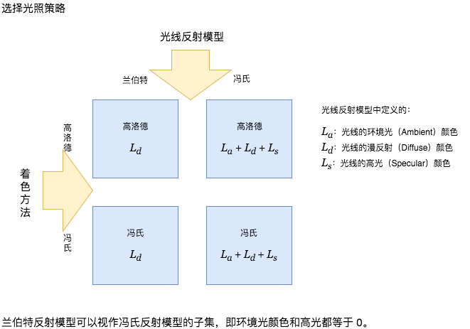


我们可以看到高洛德插值的两种情况，分别是使用兰伯特反射和冯氏反射；而对于冯氏插值只有一种情况，这是因为兰伯特反射模型可以视作冯氏反射模型的子集，即环境光颜色和高光都等于 0。

### 高洛德着色加兰伯特反射

兰伯特反射模型只考虑材质的漫反射和光线的漫反射属性。总之，我们可以这样计算：

最终顶点颜色 = 光线漫反射 * 材质漫反射 * 兰伯特系数

在高洛德着色法中，兰伯特系数是计算顶点法线和光线方向向量取反后的点积获得的。在点积计算前，两者向量都需要归一化。

现在让我们看看这个示例中顶点着色器和片元着色器的代码，请查看 `ch3_Sphere_Goraud_Lambert.html`，源代码点击[这里](https://bitbucket.org/dcantor/webgl-beginners-guide-code/src/a27b84e89b926c4a79bcd3c3b566486c53c38ee2/1727_03/ch3_Sphere_Goraud_Lambert.html?at=master&fileviewer=file-view-default)。

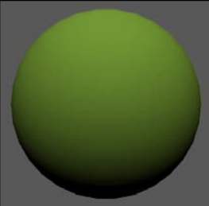

顶点着色器：

``` glsl
attribute vec3 aVertexPosition;
attribute vec3 aVertexNormal;

uniform mat4 uMVMatrix;
uniform mat4 uPMatrix;
uniform mat4 uNMatrix;

uniform vec3 uLightDirection;   //light direction
uniform vec4 uLightDiffuse;     //light color
uniform vec4 uMaterialDiffuse;  //object color

varying vec4 vFinalColor;

void main(void) {
 //Transformed normal position
 vec3 N = normalize(vec3(uNMatrix * vec4(aVertexNormal, 1.0)));
    
 //Normalize light to calculate lambertTerm
 vec3 L = normalize(uLightDirection);
 
 //Lambert's cosine law
 float lambertTerm = dot(N,-L);
 
 //Final Color
 vec4 Id = uMaterialDiffuse * uLightDiffuse * lambertTerm;
 vFinalColor = Id;
 vFinalColor.a = 1.0;
    
  //Transformed vertex position
  gl_Position = uPMatrix * uMVMatrix * vec4(aVertexPosition, 1.0);
}
```

片元着色器

``` glsl
#ifdef GL_ES
precision highp float;
#endif

varying vec4  vFinalColor;

void main(void)  {
 gl_FragColor = vFinalColor;
}
```

我们可以看到，我们把在顶点着色器中计算的最终顶点颜色通过 Varying 变量的形式输入到片元着色器。然而，所有到达片元着色器的 Varying 变量都不再是原始的值，片元着色器会针对每个片元，对 Varying 变量 `vFinalColor` 进行插值。这个插值形成了我们在第二章 几何体渲染中看到的被所有顶点围绕的图形。

### 高洛德着色加冯氏反射

与兰伯特反射不同，冯氏反射膜性要考虑三个属性：环境光、漫反射和高光。下面我们按照相同的思路来分析：

最终顶点颜色 = 环境光 + 漫反射 + 高光

环境光 = 光线环境光属性 * 材质环境光属性

漫反射 = 光线漫反射属性 * 材质漫反射属性 * 兰伯特系数

高光 = 光线高光属性 * 材质高光属性 * 高光系数

需要注意的是：

- 因为我们使用的是高洛德插值，所以我们使用的是顶点法线来计算漫反射。当我们改用冯氏插值的时候，我们将会使用片元法线。
- 光线和材质都有三个相同的属性：环境光颜色、漫反射颜色和高光颜色。
- 我们可以看到参与计算最终顶点颜色的环境光、漫反射、高光，是由光线和材质的各自的相对应属性计算的。

基于我们队冯氏反射模型的认识，我们可以这样计算高光系数：

``` glsl
float specular = pow(max(dot(R, E), 0.0), f);
```

其中：

`E` 是视线向量或相机向量。

`R` 是反射光线向量。

`f` 是高光指数，或者被称为“光泽度”。

`R` 的计算方式如下：

``` glsl
R = reflect(L, N)
```

其中 `N` 是顶点向量；`L` 是光线方向，我们曾用它来计算兰伯特系数。

让我们来看一看着色器代码。

顶点着色器：

``` glsl
attribute vec3 aVertexPosition;
attribute vec3 aVertexNormal;
uniform mat4 uMVMatrix;
uniform mat4 uPMatrix;
uniform mat4 uNMatrix;
uniform float uShininess;
uniform vec3 uLightDirection;
uniform vec4 uLightAmbient;
uniform vec4 uLightDiffuse;
uniform vec4 uLightSpecular;
uniform vec4 uMaterialAmbient;
uniform vec4 uMaterialDiffuse;
uniform vec4 uMaterialSpecular;
varying vec4 vFinalColor;

void main(void) {

	vec4 vertex = uMVMatrix * vec4(aVertexPosition, 1.0);

	vec3 N = vec3(uNMatrix * vec4(aVertexNormal, 1.0));
	vec3 L = normalize(uLightDirection);
	float lambertTerm = clamp(dot(N,-L),0.0,1.0);
	vec4 Ia = uLightAmbient * uMaterialAmbient;
	vec4 Id = vec4(0.0,0.0,0.0,1.0);
	vec4 Is = vec4(0.0,0.0,0.0,1.0);

	Id = uLightDiffuse* uMaterialDiffuse * lambertTerm;

	vec3 eyeVec = -vec3(vertex.xyz);
	vec3 E = normalize(eyeVec);
	vec3 R = reflect(L, N);
	float specular = pow(max(dot(R, E), 0.0), uShininess );
	Is = uLightSpecular * uMaterialSpecular * specular;

	vFinalColor = Ia + Id + Is;
	vFinalColor.a = 1.0;
	gl_Position = uPMatrix * vertex;
	
}
```

当物体是凹陷的或者物体处于光源和视线之间的时候，我们会得到一个负的兰伯特系数，这是因为在这两种情况下，光线方向向量取反后，与法线向量形成了一个钝角，所以最后会得到一个负的点积，如下图所示：


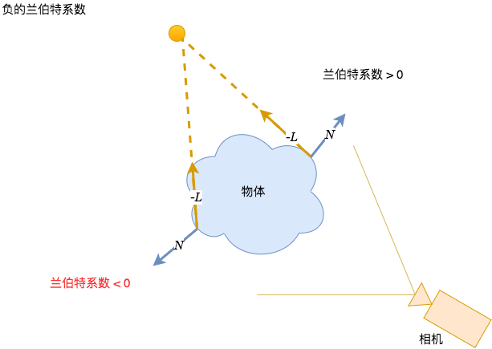

因此我们使用了 ESSL 中的 `clamp()` 函数来限制点积为正值。如果计算出来的点积是负值，`clamp()` 函数将会将兰伯特系数设置为 0，相对应的漫反射将会被忽略，在这种情况下我们只能看到环境光对场景的影响。

`clamp()` 函数的语法为：

`clmap(x, minVal, maxVal)`

它的意思是，将用 `x` 与 `minVal` 对比，取最大值；然后用该值与 `maxVal` 对比取最小值，然后返回该最小值，以此实现将 `x` 限制在 `minVal` 到 `maxVal` 的区间之内的效果。换言之，它实际是 `min(max(x, minVal), maxVal)` 的语法糖。

因为我们仍在使用高洛德插值，所以片元着色器的代码没有变化。

``` glsl
#ifdef GL_ES
precision highp float;
#endif

varying vec4 vFinalColor;

void main(void)
{

	gl_FragColor = vFinalColor;
 
} 
```

在本小节中，无论我们使用的哪种反射模型，我们都是在顶点着色器中计算出顶点颜色，然后将顶点颜色进行插值获取片元颜色的，这就是所谓的高洛德插值着色方法。接下来让我们将这一过程移到片元着色器，来看看如何实现冯氏插值方法。

## 冯氏着色法

和高洛德插值只计算每个顶点的最终颜色不同的是，冯氏插值会计算每个片元的最终颜色。这也就是说，冯氏反射模型中的环境光、漫反射和高光参数都会移步到片元着色器中计算，而不是顶点着色器。你可以想象一下，相比之前我们的几个场景来说，它的计算更为复杂。然而，我们会获得一个更加真实的场景效果。

那么我们需要在顶点着色器中做些什么呢？好吧，在这个示例中，我们将会把所有需要用于计算的数据，都通过 Varying 变量的形式输送到片元着色器。想想之前法线的例子。

在之前我们只是为每个顶点计算出法线，而现在通过插值我们可以获得每个片元的法线，所以我们就可以针对每个片元计算它们各自的兰伯特系数。我们将顶点法线通过 Varying 变量输送到片元着色器插值来实现这个目的。尽管如此，实际上代码非常简单。所有我们需要知道的就是，创建一个 Varying 变量来储存顶点法线，然后在片元着色器中获取插值。OK，完成了！


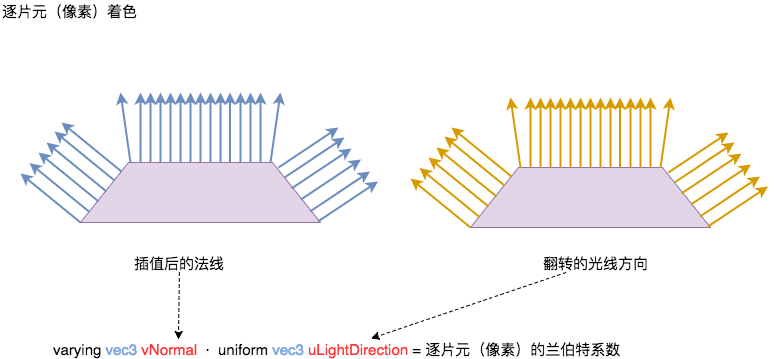


现在让我们来看一下冯氏着色法下的顶点着色器代码：

``` glsl
attribute vec3 aVertexPosition;
attribute vec3 aVertexNormal;
uniform mat4 uMVMatrix;
uniform mat4 uPMatrix;
uniform mat4 uNMatrix;
varying vec3 vNormal;
varying vec3 vEyeVec;

void main(void) {

	 vec4 vertex = uMVMatrix * vec4(aVertexPosition, 1.0);
	 vNormal = vec3(uNMatrix * vec4(aVertexNormal, 1.0));
	 vEyeVec = -vec3(vertex.xyz);
	 gl_Position = uPMatrix * uMVMatrix * vec4(aVertexPosition, 1.0);
	 
}
```

和高洛德插值不同的是，顶点着色器的代码看起来很简单了。我们没有计算最终颜色，只是用 Varying 变量将两个数据输送到片元着色器。而片元着色器则看起来要复杂多了。

``` glsl
uniform float uShininess;
uniform vec3 uLightDirection;
uniform vec4 uLightAmbient;
uniform vec4 uLightDiffuse;
uniform vec4 uLightSpecular;
uniform vec4 uMaterialAmbient;
uniform vec4 uMaterialDiffuse;
uniform vec4 uMaterialSpecular;
varying vec3 vNormal;
varying vec3 vEyeVec;

void main(void)
{

	 vec3 L = normalize(uLightDirection);
	 vec3 N = normalize(vNormal);
	 float lambertTerm = dot(N,-L);
	 vec4 Ia = uLightAmbient * uMaterialAmbient;
	 vec4 Id = vec4(0.0,0.0,0.0,1.0);
	 vec4 Is = vec4(0.0,0.0,0.0,1.0);
	 if(lambertTerm > 0.0)
	 {
		 Id = uLightDiffuse * uMaterialDiffuse * lambertTerm;

		 vec3 E = normalize(vEyeVec);
		 vec3 R = reflect(L, N);
		 float specular = pow( max(dot(R, E), 0.0), uShininess);

		 Is = uLightSpecular * uMaterialSpecular * specular;
	 }
	 vec4 finalColor = Ia + Id + Is;
	 finalColor.a = 1.0;
	 gl_FragColor = finalColor;
	 
}
```

当我们使用 Varying 变量传输向量时，有可能在插值的过程中丢失归一化特性，因此你可以看到我们在使用 `vNormal` 和 `vEyeVec` 前都对它们进行了归一化处理。

## 返回 WebGL

是时候让我们重返 JavaScript 代码了。现在我们该如何关闭 JavaScript 代码和 ESSL 代码的缝隙呢？

首先让我们看下我们是如何使用 WebGL 上下文创建着色器程序的。请记住，我们把顶点着色器和片元着色器统称为着色器程序（Program）。

其次，我们需要知道如何初始化 Attribute 和 Uniform 变量。

让我们先来看下我们的网页应用的架构：


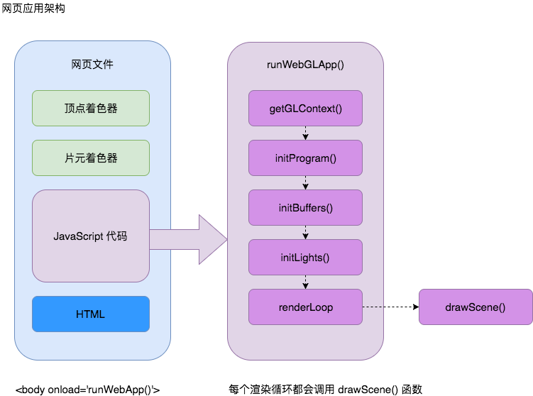

网页文件中都先被嵌入了顶点着色器和片元着色器的代码，然后我们在 `<script>` 标签中写所有 WebGL 的代码，最后是 HTML 代码来定义页面元素，例如标题、控件位置，以及 `<canvas>` 画布。

在 JavaScript 代码中，我们在网页触发 `onload` 事件时调用 `runWebApp()` 函数。这是我们的网页应用的入口。而 `runWebApp()` 函数干的第一件事就是为 `<canvas>` 画布获取 WebGL 上下文，然后调用了一些列函数来初始化着色器程序、WebGL 缓存和灯光。最后进入渲染循环，每次渲染循环都会调用 `drawScene()` 函数。在这一章节中，我们将会详细研究 `initProgram()` 函数和 `initLights()` 函数。前者用于创建并编译 ESSL 着色器程序，后者则是用于初始化光照，并将相关数据赋值给着色器程序中定义的 Uniform 变量。在 `initLights()` 函数中，我们将会定义光源的位置、方向和颜色相关的属性（环境光、漫反射和高光），同时我们还会给材质的相关属性赋一个默认值。

### 创建着色器程序

让我们一步步的来看 `initProgram()` 函数：

``` javascript
var prg; //global variable
function initProgram() {
```

首先我们使用了工具函数 `utils.getShader(WebGLContext, DOM_ID)` 来获取顶点着色器和片元着色器的源代码。

``` javascript
 var fragmentShader= utils.getShader(gl, "shader-fs");
 var vertexShader= utils.getShader(gl, "shader-vs");
```

在这里我们花点时间来讲解一下 `getShader()` 这个函数。这个函数的第一个参数是 WebGL 上下文。第二个参数是包含着色器源代码的 `<script>` 标签的 DOM id。在内部，`getShader()` 函数将会读取脚本标签中的内容，并把它储存在名为 `str` 的本地变量中。然后会执行下列语句：

``` javascript
var shader;
 if (script.type == "x-shader/x-fragment") {
 	shader = gl.createShader(gl.FRAGMENT_SHADER);
 } else if (script.type == "x-shader/x-vertex") {
 	shader = gl.createShader(gl.VERTEX_SHADER);
 } else {
 	return null;
 }
 gl.shaderSource(shader, str);
 gl.compileShader(shader); 
```

基本上，上述代码片段会使用 WebGL 的 `gl.createShader()` 函数创建一个着色器，然后使用 `gl.shaderSource()` 函数将源代码传入着色器，最后使用 `gl.compileShader()` 函数对着色器代码进行编译。

`getShader()` 函数位于 `js/util.js` 中，在这个章节中，我们会一直使用这个工具函数，源代码点击[这里](https://bitbucket.org/dcantor/webgl-beginners-guide-code/src/a27b84e89b926c4a79bcd3c3b566486c53c38ee2/1727_03/js/utils.js?at=master&fileviewer=file-view-default)。
 
回到 `initProgram()` 函数，我们使用下面的几行代码创建了着色器程序：

``` javascript
prg = gl.createProgram();
gl.attachShader(prg, vertexShader);
gl.attachShader(prg, fragmentShader);
gl.linkProgram(prg);
if (!gl.getProgramParameter(prg, gl.LINK_STATUS)) {
	alert("Could not initialize shaders");
}
gl.useProgram(prg);
```

在这里我们使用了许多由 WebGL 上下文提供的函数：

- `createProgram()`：创建一个新的着色器程序（Program）。
- `attachShader(Object program, Object shader)`：把一个着色器附加到当前的着色器程序上。
- `linkProgram(Object program)`：创建输送给 GPU 可执行版本的顶点着色器和片元着色器。
- `getProgramParameter(Object program, Object parameter)`：这个函数同 WebGL 的状态机机制有关。它允许我们查询着色器程序的参数。我们在这里使用这个函数来检测可执行版本的着色器程序是否被成功创建。
- `useProgram(Object program)`：如果着色器程序代码合法（也就是说 `linkProgram()` 成功），将会在 GPU 中使用该着色器程序。

最后，我们在 JavaScript 变量和着色器程序中的 Attribute 和 Uniform 变量间做了一个映射。我们在这里没有创建更多的 JavaScript 变量，而是将它们附在 `prg` 对象上。这个设计本身和 WebGL 没有关系，我们只是因为“洁癖”将所有相关的 JavaScript 变量都作为着色器程序对象的一部分。

``` javascript
prg.aVertexPosition = gl.getAttribLocation(prg, "aVertexPosition");
prg.aVertexNormal = gl.getAttribLocation(prg, "aVertexNormal");
prg.uPMatrix =gl.getUniformLocation(prg, "uPMatrix");
prg.uMVMatrix = gl.getUniformLocation(prg, "uMVMatrix");
prg.uNMatrix = gl.getUniformLocation(prg, "uNMatrix");


prg.uLightDirection = gl.getUniformLocation(prg, "uLightDirection");
prg.uLightAmbient = gl.getUniformLocation(prg, "uLightAmbient");
prg.uLightDiffuse = gl.getUniformLocation(prg, "uLightDiffuse");
prg.uMaterialDiffuse = gl.getUniformLocation(prg,"uMaterialDiffuse");
}
```

以上就是 `initProgram` 函数的全部代码。在这里我们使用了下面的 WebGL 函数：

- `Var reference = getAttribLocation(Object program,String name)`：这个函数接受两个参数，一个是着色器程序对象，另外一个是 Attribute 变量名称的字符串。这个函数将返回对应 Attribute 变量的引用。
- `var reference = getUniformLocation(Object program,String uniform)`：这个函数接受两个参数，一个是着色器程序对象，另外一个是 Uniform 变量名称的字符串。这个函数将返回对应 Uniform 变量的引用。

获得了着色器程序中变量的引用之后，我们就可以开始初始化 Attribute 和 Uniform了。

### 初始化 Attribute 和 Uniform

一旦我们编译并安装好着色器程序，下一步就是初始化 Attribute 和 Uniform 变量了。我们在 `initLights` 函数中初始化了 Uniform 变量。

``` javascript
function initLights(){
 gl.uniform3fv(prg.uLightDirection, [0.0, 0.0, -1.0]);
 gl.uniform4fv(prg.uLightAmbient, [0.01,0.01,0.01,1.0]);
 gl.uniform4fv(prg.uLightDiffuse, [0.5,0.5,0.5,1.0]);
 gl.uniform4fv(prg.uMaterialDiffuse, [0.1,0.5,0.8,1.0]);
}
```

你可以看到我们使用了在 `initProgram` 函数中通过 `getUniformLocation` 获得的 Uniform 变量的引用，然后使用了下面几个 WebGL 提供的函数去设置 Uniform 变量。

- `uniform[1234][fi]`：指定一个

 
 